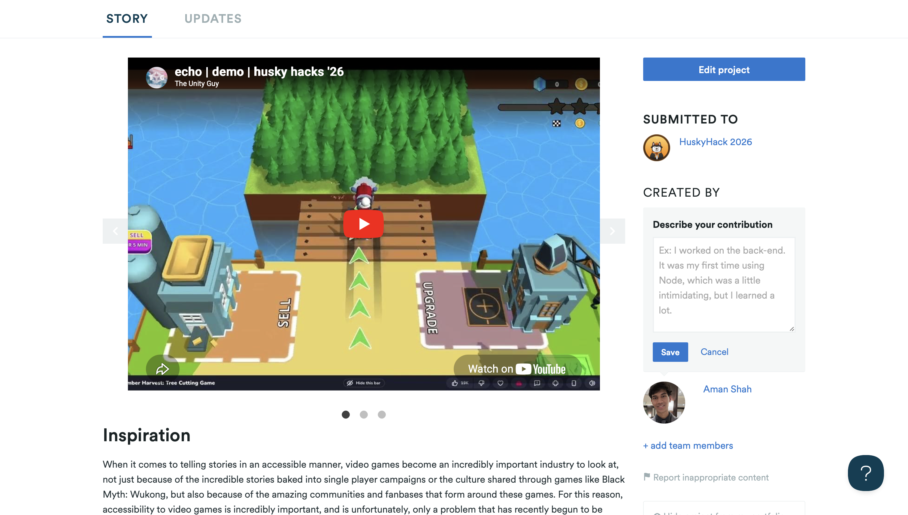

# Echo: AI-Powered Voice Navigation for the Visually Impaired


> *"Echo is the co-pilot that never stops watching — a voice-first AI companion that describes, remembers, and responds, so blind users can navigate the web on equal footing."*

---



**🔗 Devpost:** [Echo on Devpost](https://devpost.com/software/echo-56rszh)

---

## The Problem

Over 285 million people worldwide live with visual impairment. Navigating the modern web — filling out forms, reading articles, using web apps — depends almost entirely on sight. Screen readers help, but they're brittle, context-unaware, and completely lost the moment a site doesn't follow accessibility standards.

Echo is a different approach. Instead of relying on a website to be accessible, Echo watches your screen and describes it — in real time, in plain language, on demand. It works on any website, any app, any content.

## What Echo Does

- **Live Screen Narration** — Continuously captures your screen and reads it aloud using Gemini 2.5 Flash. Descriptions are spatial and contextual, not just raw text dumps.
- **On-Demand Description** — Press a key to get an immediate, full breakdown of whatever's currently on screen.
- **Ask Anything** — Enter question mode and speak naturally: *"What does this form want from me?"*, *"Is there a login button?"*, *"What's in the top-right corner?"*
- **Persistent Memory** — Powered by Backboard.io, Echo remembers things across sessions: sites you've visited, preferences you've set, tasks you were in the middle of. When you come back, it catches you up.
- **Danger Alerts** — A background Sentinel agent watches for time-sensitive things (popups, expiring sessions, error messages) and interrupts narration to flag them.
- **Document Q&A** — Upload a PDF or document and ask questions about it alongside what's on screen. Useful for following along with instructions or referencing help docs.
- **No UI Required** — Echo runs entirely through audio and hotkeys. There's nothing to look at.

## Setup

### Requirements

- Python 3.10+
- macOS (primary platform — cross-platform support in progress)
- `portaudio` and `flac` for microphone input:

```bash
brew install portaudio flac
```

### Installation

```bash
git clone https://github.com/yourusername/echo.git
cd echo
python -m venv venv
source venv/bin/activate
pip install -r requirements.txt
```

### API Keys

Create a `.env` file in the root directory:

```env
GEMINI_API_KEY=your_gemini_key
BACKBOARD_API_KEY=your_backboard_key

# Optional — for cycling between vision providers
CEREBRAS_API_KEY=your_cerebras_key
OPENROUTER_API_KEY=your_openrouter_key
```

## Usage

```bash
python main.py
```

Echo greets you on launch, recaps your last session if one exists, then runs in the background. Everything is controlled by hotkeys and voice.

### Hotkeys

| Key | Action |
|-----|--------|
| `Space` | Describe what's currently on screen |
| `Q` | Enter question mode — speak after the beep |
| `P` | Pause / resume continuous narration |
| `V` | Cycle through vision providers |
| `+` / `-` | Speed up / slow down speech |
| `Esc` | Stop current narration |

### Voice Commands (in Question Mode)

- *"What does this page say?"*
- *"Is there a submit button?"*
- *"Remember that my username on this site is john_doe."* — saves to memory
- *"What was I doing last time?"* — recalls previous session

## How It Works

| Layer | Technology | Role |
|-------|------------|------|
| Screen Capture | `mss` | Fast, low-overhead screen grabs |
| Vision AI | Gemini 2.5 Flash | Describes screen content in natural language |
| Memory | Backboard.io | Persistent session state and user preferences |
| Multi-Agent | `asyncio` + threads | Narrator and Sentinel run in parallel |
| Voice Input | SpeechRecognition | Converts speech to text for queries |
| Text-to-Speech | macOS `say` / `pyttsx3` | Native audio output, no extra setup |

## Hackathon Tracks

**HuskyHacks 2026**

- **Best Reach** — Targets a real, underserved population with a practical tool
- **Wild Experiment** — No screen, no cursor, no traditional UI whatsoever
- **Backboard.io Track** — Stateful memory, multi-agent orchestration, and document RAG
- **Google Gemini** — Powered by Gemini 2.5 Flash for fast, multimodal scene understanding

---

*Built for a more accessible web.*